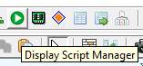
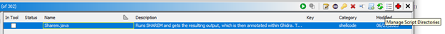
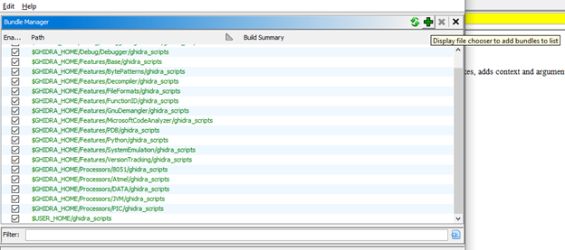

# GhidraScripts
Scripts to run within Ghidra, maintained by the Trellix ARC team.

## How to use Ghidra scripts
When Ghidra’s CodeBrowser is open, the green play button in the icon row opens the Script Manager, as can be seen in the screenshot below. Alternatively, one can open the Window tool strip menu item, and select Script Manager.

Once open, one can manage the script directories with the hamburger menu in the top right corner of the Script Manager.

Within that menu, one can click on the green plus to add a folder to the list of locations where scripts are fetched from. Once added, press the two green arrows to refresh the list.

Once the refresh action has completed, the script should be in the list, and can be searched for using the textbox next to the filter label. To execute a script, simply double click it, or press the green play button within the Script Manager.

### Golang related scripts
Simply run the scripts and observe the output in the Console Log. Error messages are indicative of what went wrong (i.e. a non supported file format, or an issue finding a specific data structure). Non-error messages are indicative of what the script has changed and updated.

### BSim function rename script
Run the script and provide all requested values. When running headless, provide the values via the CLI in the order of the menu field. The script's runtime will take a while. The database path should not include the double extension (".mv.db"), or the file will not be able to be found by Ghidra.

### FunctionID database generation script
Run this script headless and provide the requested values via the CLI. FunctionID databases are then generated, which can then be attached to Ghidra during subsequent analysis runs.

### MalpediaFlossedCheck[Local/WebApi].java
With this script, one can compare the [Malpedia FLOSSED](https://github.com/malpedia/malpedia-flossed) data set with the strings from the current program. Strings that do not occur in Malpedia's data set, are likely to be more uncommon, and likely warrant some more inspection, as they can be useful. Download and extract the [Malpedia FLOSSED](https://github.com/malpedia/malpedia-flossed) JSON file, and remember its location, as its required during the script's runtime.

There are two scripts to use, where the one named local will use the local JSON file (extracted from the ZIP archive). Given its size, and the requirement to load and parse it completely, one needs to allow the JavaVM via which Ghidra is started with more memory than it is given by default. This method is slow, yet fully local. The script named web API will query the web API service. One can host this locally (or on another machine that is privately owned), or one can use the public service which Malpedia is providing as-is.

### Sharem.java
Configure [SHAREM](https://github.com/Bw3ll/sharem/) to run [headless](https://github.com/Bw3ll/sharem/wiki/2.-Quick-Start-Analysis#configuration-file), and edit the script to contain the correct path to both Python and SHAREM's main Python file. Additionally, ensure the correct parameter for the shellcode's bitness is used, along with the correct path to the shellcode sample. Once all is configured, simply run the Ghidra script and wait until SHAREM finishes its execution. There is no progress bar for SHAREM's execution. Once it is done, the code will load the JSON file and start annotating the given offsets in Ghidra, which will be visible in the Console Log.

## Questions and/or feedback
Please open an issue in this repository with any questions and/or feedback you have, as long as it is related to the scripts within the repository.
